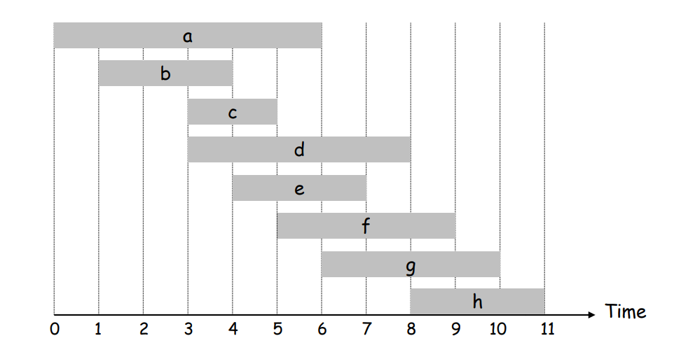

# AlgoritmosAmbiciosos_Agenda_Otima

**Número da Lista**: 3 
**Conteúdo da Disciplina**: Algoritmos Ambiciosos 

## Alunos
|Matrícula | Aluno |
| -- | -- |
| 20/2045348  |  Ingrid Alves Rocha |
| 22/2022000 |  Milena Fernandes Rocha|

## Sobre 
O objetivo principal deste projeto é criar uma ferramenta inteligente de gerenciamento de agenda que ajude o usuário a maximizar sua participação em eventos. Em vez de simplesmente listar compromissos, a aplicação analisa todos os eventos inseridos e, de forma automática, constrói a melhor agenda possível para evitar sobreposições de horários. O algoritmo ambicioso usado foi o Interval Scheduling, onde ordenamos de forma crescente pelo horário de término. 

## Screenshots

- Exemplo do slide do professor:
    

- Exemplo na Aplicação:
    

    

- Algoritmo usado no [código](https://github.com/projeto-de-algoritmos-2025/AlgoritmosAmbiciosos_Agenda_Otima/blob/master/script.js)
  

## Instalação 
**Linguagem**: JavaScript, HTML e CSS 
**Link para Testar a Aplicação**: https://projeto-de-algoritmos-2025.github.io/AlgoritmosAmbiciosos_Agenda_Otima/

## Uso 

- Acesse o [link](https://projeto-de-algoritmos-2025.github.io/AlgoritmosAmbiciosos_Agenda_Otima/) 
- Preencha um formulário simples com o nome do evento, a data, a hora de início e a hora de fim.
- Ao clicar em "Adicionar Evento", um objeto de evento é criado com um ID único (baseado na data e hora atuais) e as informações fornecidas.
-  Depois veja sua Agenda Ideal para aproveitar o maior número de eventos possivéis.

## Link do Vídeo

**Fonte:** [Milena Rocha](https://github.com/milenafrocha) e [Ingrid Alves](https://github.com/alvesingrid)
Disponível em: [https://youtu.be/YerlkggQD64](https://youtu.be/YerlkggQD64)
Acesso em: 30 de maio. 2025.

---

